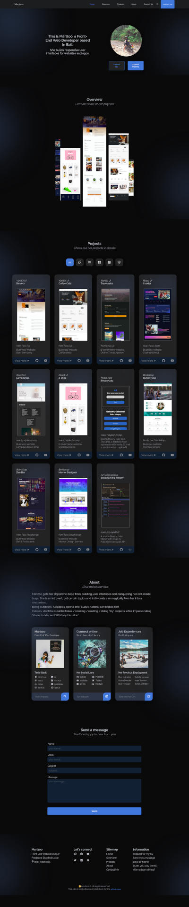

## DESCRIPTION:
- Vanilla Website for Marizoo's Web Dev portfolio
- [Youtube Video of the App](https://youtu.be/06EkG4IqroE)
- FYI: For privacy reason, the original repo is set to private.
    - This is a copy of the original repo.
    - Images & Private data have been erased from this repo.

## TECH STACKS:
- HTML + CSS + JS
- Libraries:
    - swiperjs
    - mixitupjs
    - emailJS.

## PROGRESS:
- Done: 100%.
- Responsive: 100%.

## View other projects:
- [My Blog1](https://dev.to/marizoo)
- [My Blog2](https://medium.com/@marizoo)
- [My Pinterest](https://pin.it/16vGwjy)
- [My Youtube Channel](https://www.youtube.com/channel/UCfkbnM9WvHD3mjecBiGHCBQ/playlists)

## IMAGE:

